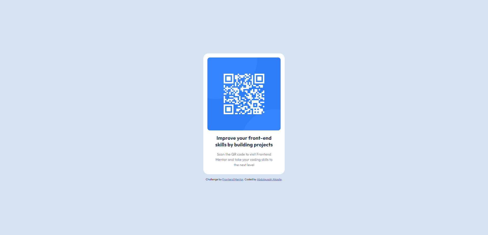

# Frontend Mentor - QR code component solution

## Table of contents

- [Overview](#overview)
  - [Screenshot](#screenshot)
  - [Links](#links)
- [My process](#my-process)
  - [Built with](#built-with)
  - [What I learned](#what-i-learned)
  - [Continued development](#continued-development)
  - [Useful resources](#useful-resources)
- [Author](#author)

## Overview

In this project, I was tasked with creating a responsive QR Code Component Design for both mobile and web platforms. The project requirements included specifying the font name, size, and colors to be used.

### Screenshot



### Links

- Solution URL: [GitHub Pages](https://github.com/Abdulquadri-Akos/QR-Component-Design)
- Live Site URL: [Vercel](https://qr-component-design-ten.vercel.app/)

## My process

I utilized HTML and CSS for this project. HTML was used to structure the content and display the QR codes, while CSS was used to style the HTML elements, making them visually appealing and colorful.

One key aspect of my approach was setting the root font size to 62.5%, which is a common practice for establishing a consistent base font size. This allowed me to use rem units for all font sizes across the project, ensuring scalability and flexibility in design.

Additionally, I made extensive use of CSS variables, which helped me manage and maintain consistent styles throughout the project, making it easier to update and modify the design as needed.

### Built with

- Semantic HTML5 markup
- CSS custom properties
- Flexbox

### What I learned

I learned a useful calculation technique for setting the root font size. By dividing the desired pixel value by the base font size (16px) and multiplying by 100%, I determined that setting the root font size to 62.5% would make 1rem equal to 10px. This approach ensured a consistent and easily scalable font size across the project.

```css
:root {
  font-size: 62.5%;
}
```

### Continued development

Enhance user experience with intuitive interfaces. Optimize performance for fast loading, especially on mobile. Ensure accessibility for all users. Design for responsiveness. Implement strong security measures. Plan for scalability. Foster collaboration and communication. Include a feedback mechanism. Provide clear documentation. Continuously improve based on feedback and technology advancements.

### Useful resources

- [John Comeau CSS Reset](https://www.joshwcomeau.com/css/custom-css-reset/) - This helped me for CSS Reset Best Practice. I really liked this pattern and will use it going forward.
- [The 62.5% Font Size Trick](https://www.aleksandrhovhannisyan.com/blog/62-5-percent-font-size-trick/) - This is an amazing article which helped me finally understand Font Size Trick. I'd recommend it to anyone still learning this concept.

## Author

- Website - [Abdulquadri Akosile](https://github.com/Abdulquadri-Akos)
- Frontend Mentor - [@Abdulquadri Akosile](https://www.frontendmentor.io/profile/Abdulquadri-Akos)
- Twitter - [@Abdulquadri Akosile](https://twitter.com/AkosileQuadri)
